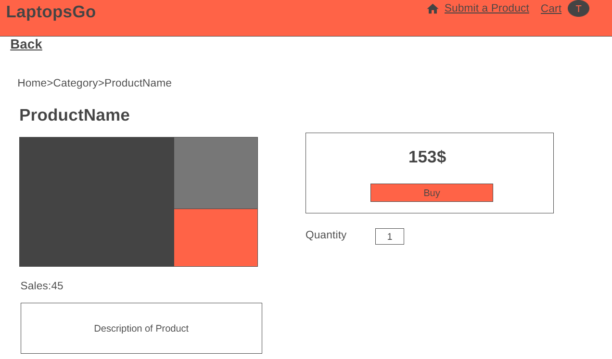
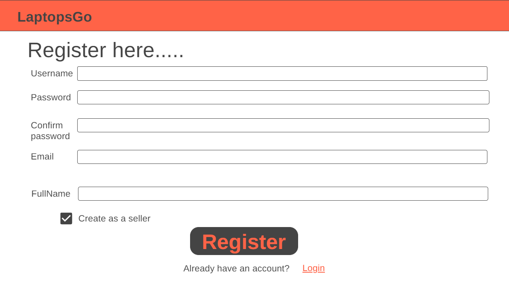

# ** LaptopsGo **

## Convenient marketplace to trade laptop from new to used for everybody.

LaptopsGo aims to provide an online marketplace for user to quickly and easily buy and sell their product, LaptopsGo connects retail store or inviduals who are looking for a platform to sell their product and buyer who want to buy a high quality product.

## Team

-   Phan Văn Tiếp Em (SE150335)
-   Võ Văn Bảo Duy (SE160175)
-   Lê Văn Hà (SE140685)

## User

-   Student, Officer, Online shop, and who want to buy and sell laptop

## Features
#### All user
-   Create accounts.
-   Login, Logout.
-   View, filter, search product.
-   View and edit account.

#### Admin

-   Ban user.
-   Remove product.
-   Manage categories, brands.

#### Buyer:

-   Add products to cart.
-   View, Remove cart items.
-   Checkout.

#### Seller:

-   Submit products to sell.
-   View , Edit, Remove products.

## Sitemap

## Wireframe

#### Home page:

#### Product detail page:

#### Cart page:

#### CheckOut page:

#### SellerDashboard page: (only for seller role)

#### Submit product page: (only for seller role)

#### Account list page: (only for admin role)

#### Login page:

#### Register page:

#### Account page:

## Database Design

#### Logical design (buyer, seller and admin role are splitted to present seperately from Users entity)

#### Physical design

The database diagram bellow shows how the system's logical design is implemented in the database. Three roles Buyer, Seller and Admin entities in logical design are grouped into only one entity User in physical design.

## System Design
- Naming convention: camel case.
- File naming convention: camel case for jsp files and pascal case for java files.
- Naming CSS class name with BEM methodology.
- Database: camel case for columns, pascal case for table.
##### Folder structures:
The images bellow show how the system is implemented using the MVC model.
| Component | Image | 
| --------- | ----- |
| Controllers | (./assets/system-design/controller.png) |
| Models | (./assets/system-design/model.png) |
| Views | (./assets/system-design/pages.png) |

## Conclusion
##### Pros
- Simple and convenient buying and selling experience.
- Truthful adaptation of the MVC pattern.
##### Cons
- Missing some important features such as: report product, upload image, forgot password, notification, etc.
- Messy codebase.
##### What we have learned
- MVC, MVC2 pattern.
- Design Database
- Design and implement a web application from start to finish.
##### Possible future improvements
- Add missing features.
- Refactor methods and variables name.
- Improve database design.
