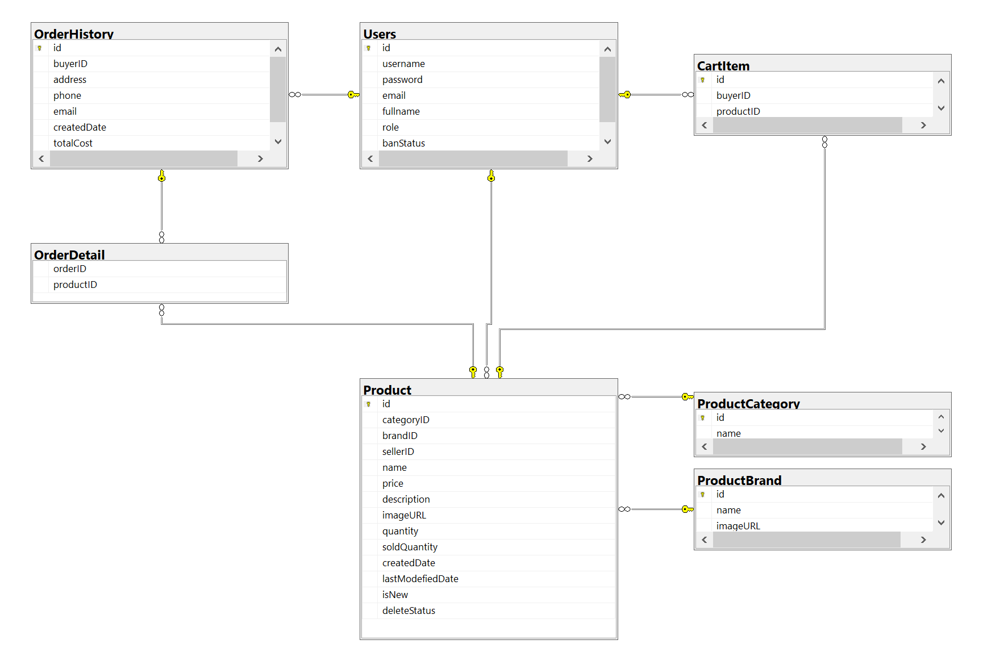

# ** LaptopsGo **

## Convinience marketplace to trade laptop from new to used for everybody.

LaptopsGo aims to provides an online marketplace with basic UI for user to quickly and easily buy and sell their product(laptop only), building a brigde to connect retail store that are looking for a platform to sell their product and buyer who want to buy a high quality product.

## Team

-   Phan Văn Tiếp Em (SE150335)
-   Võ Văn Bảo Duy (SE160175)
-   Lê Văn Hà (SE140685)

## User

-   Student, Officer, Online shop, and who want to buy and sell laptop

## Features

-   Create accounts.
-   Login, Logout.
-   View, sort, search product.
-   View and edit account.

#### Admin

-   Ban user.
-   Search, Remove seller's product.
-   Manage categories.
-   Review, Approve, Ignore reports.

#### Buyer:

-   Add products to cart.
-   View, change quantity, Remove cart items.
-   Checkout.
-   Report products.

#### Seller:

-   Submit products to sell.
-   View , Edit, Remove products.

## Sitemap

## Wireframe

#### Home page:

#### Product detail page:

#### Cart page:

#### CheckOut page:

#### SellerDashboard page: (only for seller role)

#### Submit product page: (only for seller role)

#### Review report page: (only for admin role)

#### Account list page: (only for admin role)

#### Login page:

#### Register page:

#### Account page:

## Database Design

#### Logical design (buyer, seller and admin role are splitted to present seperately from Users entity)

#### Physical design

The database diagram bellow shows how the system's logical design is implemented in the database. Three roles Buyer, Seller and Admin entities in logical design are grouped into only one entity User in physical design.

